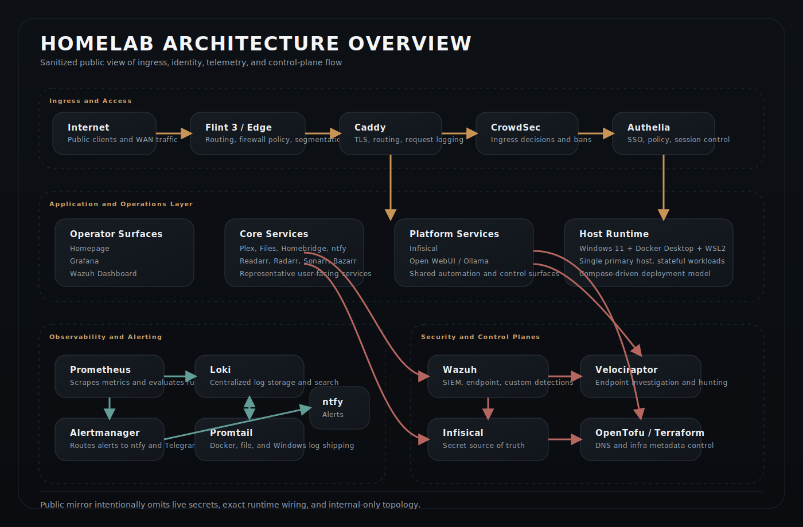

<h1 align="center">Homelab</h1>

  Public mirror of a private homelab focused on access control, observability, and security operations.

  <a href="https://asharahmed.github.io/homelab/"><strong>Interactive overview</strong></a>
  ·
  <a href="https://github.com/asharahmed"><strong>GitHub profile</strong></a>

## Overview

This repository is a sanitized public mirror of an internal homelab environment built on Windows 11, Docker Desktop, and WSL2.

Its purpose is to document the architecture, ingress model, observability stack, and security workflow of the environment without exposing private implementation details, runtime state, or sensitive configuration.

The emphasis is on system design and operational discipline rather than service count.

## Design Priorities

- centralized ingress and controlled exposure
- consistent authentication in front of sensitive services
- integrated metrics, logs, alerting, and security telemetry
- reduced secret sprawl and repeatable configuration workflows
- documentation that explains the structure and operating model of the platform

## Core Stack

**Edge and access**
- Caddy
- Authelia
- Tailscale

**Observability**
- Prometheus
- Alertmanager
- Grafana
- Loki
- Promtail
- Blackbox Exporter
- Uptime Kuma

**Security**
- CrowdSec
- Wazuh
- Velociraptor
- Trivy
- Renovate

**Platform**
- Infisical
- OpenTofu / Terraform
- Docker Compose

## Public Repository Contents

- [index.html](index.html): GitHub Pages project page
- [docker-compose.public.yml](docker-compose.public.yml): representative Compose layout for the public-facing parts of the stack
- [Caddyfile.public](Caddyfile.public): scrubbed Caddy configuration showing ingress and authentication patterns
- [DECISIONS.md](DECISIONS.md): engineering tradeoffs behind the stack
- [.env.example](.env.example): scrubbed environment-variable reference for the public examples
- [config](config): sample Authelia and Infisical bootstrap configuration
- [docs/security-architecture.md](docs/security-architecture.md): layered security model
- [infra/terraform](infra/terraform): external DNS and infrastructure metadata scaffold
- [scripts](scripts): selected bootstrap, validation, and security workflow scripts
- [tools/monitoring](tools/monitoring): monitoring examples with private and download-specific components removed
- [artifacts/homepage-theme](artifacts/homepage-theme): sanitized dashboard design artifacts

## Representative Architecture

The diagram reflects the public component model in this repository: edge enforcement and ingress, operator-facing services, observability, and separate security/control planes.

## Scope

This repository is not intended to be a turnkey deployment source.

It is a curated public reference for:
- architecture
- ingress and authentication patterns
- monitoring and alerting layout
- security workflow examples
- Terraform/OpenTofu structure
- operator-facing documentation and scripts

The following are intentionally excluded:
- live secrets
- generated state
- exact runtime configuration from the private environment
- private hostnames, IP addresses, and internal-only service wiring

## Live Site

- GitHub Pages: https://asharahmed.github.io/homelab/
